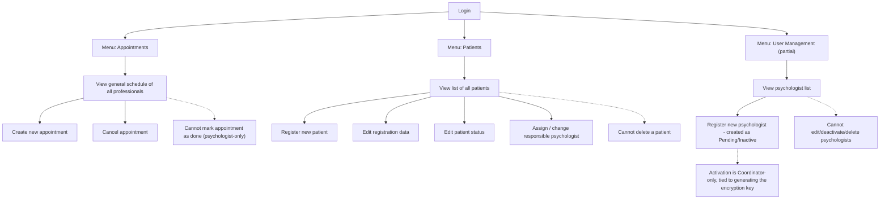
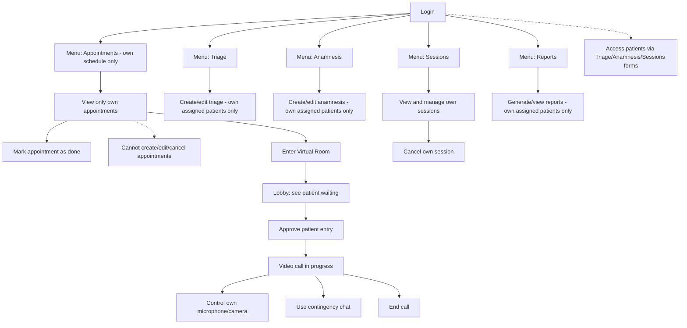
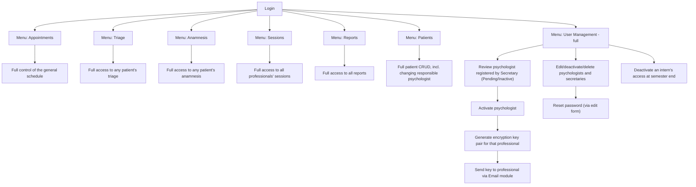
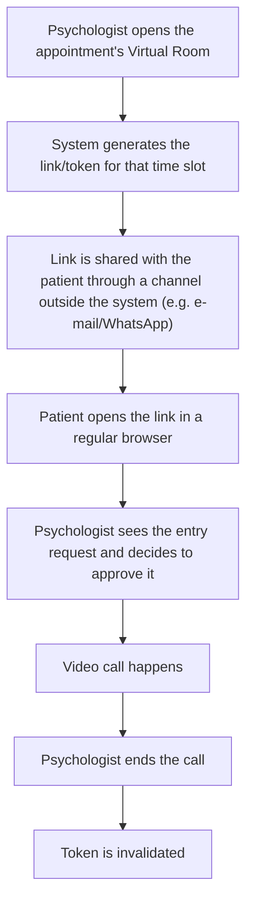

# Permissions Matrix and Navigation Flows — PsiUnisantos

> **Scope note:** this document combines the roles defined in the requirements document (Secretary, Psychologist, Coordinator, Patient) with the module/menu structure. **Coordinator = Admin**.
>
> **Language note:** the document is in English. Module and feature (functionality) names include a PT-BR translation in parentheses. Diagrams are in English.

---

## Legend

| Symbol | Meaning |
|---|---|
| ✅ Full | Complete access (create, edit, cancel) |
| 👁️ View | Read-only, no actions |
| 🔒 Own only | Restricted to the user's own records/appointments |
| ⚠️ Partial | Some actions allowed, others not |
| ❌ None | No access |

---

## 1. Core Principles & Role Definitions

Before detailing the module permissions, the following principles and role boundaries apply across the entire system:

* **Coordinator (Admin):** The sole point of administration for users and cryptographic keys, centralizing the system's security responsibility. They possess full system access to all records, schedules, and managerial features.
* **Secretary:** Responsible for administrative and front-desk operations, including patient registration, general scheduling, and the initial registration of new psychologists. They are strictly prohibited from accessing clinical, sensitive, or encrypted data, meaning they have zero access to Triage, Anamnesis, Sessions, or Reports.
* **Psychologist:** Responsible for clinical care and conducting sessions. They have access to all clinical modules (Triage, Anamnesis, Sessions, Reports, Virtual Room), but their access is strictly restricted to their own assigned patients and own appointments.
* **Patient:** The Patient is not modeled as an access profile within the system. They participate solely as external guests through secure, ephemeral Virtual Room links without any system authentication.
* **Data Retention:** A strict no-deletion data retention policy (CFP / LGPD) applies across the system for patients, professionals, and medical records.

---

## 2. Permissions Matrix, grouped by Module

> **Note:** The **Patient** column reads "No system access" throughout, per explicit business rules: the system does not include a Patient Portal or self-registration.

**Modules:** [Authentication](#21-authentication-autenticação) · [Users](#22-users-usuários) · [Patients](#23-patients-pacientes) · [Appointments / Scheduling](#24-appointments--scheduling-agendamento) · [Virtual Room](#25-virtual-room-sala-virtual) · [Triage](#26-triage-triagem) · [Anamnesis](#27-anamnesis-anamnese) · [Sessions](#28-sessions-sessões) · [Medical Record](#29-medical-record-prontuário) · [Reports](#210-reports-relatórios--laudos) · [Cryptography](#211-cryptography-criptografia) · [Email / Notifications](#212-email--notifications-e-mail--notificações)

### 2.1 Authentication (Autenticação)

| Functionality | Secretary | Psychologist | Coordinator (Admin) | Patient |
|---|---|---|---|---|
| Log in to the system (Login no sistema) | ✅ Full | ✅ Full | ✅ Full | ❌ No system access |
| Reset own password (Redefinir a própria senha) | ✅ Full | ✅ Full | ✅ Full | ❌ No system access |
| Reset another user's password (Resetar senha de outro usuário) | ❌ None | ❌ None | ✅ Full (sole admin) | ❌ No system access |
| Log out (Sair do sistema) | ✅ Full | ✅ Full | ✅ Full | ❌ No system access |

### 2.2 Users (Usuários)

| Functionality | Secretary | Psychologist | Coordinator (Admin) | Patient |
|---|---|---|---|---|
| Register new psychologist — created as Pending/Inactive (Cadastrar novo psicólogo — criado como Pendente/Inativo) | ✅ Full | ❌ None | ✅ Full | ❌ No system access |
| View psychologist list (Visualizar lista de psicólogos) | 👁️ View | ❌ None | ✅ Full | ❌ No system access |
| Activate / deactivate psychologist — includes generating & issuing the encryption key (Ativar / desativar psicólogo — inclui gerar e enviar a chave de criptografia) | ❌ None | ❌ None | ✅ Full (sole admin) | ❌ No system access |
| Edit psychologist profile data (Editar dados do perfil do psicólogo) | ❌ None | ❌ None | ✅ Full | ❌ No system access |
| Register / manage secretaries (Cadastrar / gerenciar secretários) | ❌ None | ❌ None | ✅ Full | ❌ No system access |
| View inactive professionals (Visualizar profissionais inativos) | ❌ None | ❌ None | ✅ Full | ❌ No system access |
| Define user role (Definir papel do usuário) | ❌ None | ❌ None | ✅ Full | ❌ No system access |
| Delete user (Excluir usuário) | ❌ None | ❌ None | ❌ None (no-deletion policy) | ❌ No system access |

### 2.3 Patients (Pacientes)

| Functionality | Secretary | Psychologist | Coordinator (Admin) | Patient |
|---|---|---|---|---|
| Register new patient (Cadastrar novo paciente) | ✅ Full | ❌ None | ✅ Full | ❌ No system access |
| Edit registration data (Editar dados cadastrais) | ⚠️ Partial (no delete) | ❌ None | ✅ Full | ❌ No system access |
| Edit patient status (Editar status do paciente) | ✅ Full | ❌ None | ✅ Full | ❌ No system access |
| Assign / change responsible psychologist (Atribuir / alterar psicólogo responsável) | ✅ Full | ❌ None | ✅ Full | ❌ No system access |
| View patient list (Visualizar lista de pacientes) | ✅ Full (all) | 🔒 Own only (assigned patients) | ✅ Full (all) | ❌ No system access |
| Delete patient (Excluir paciente) | ❌ None | ❌ None | ❌ None (no-deletion policy) | ❌ No system access |

### 2.4 Appointments / Scheduling (Agendamento)

| Functionality | Secretary | Psychologist | Coordinator (Admin) | Patient |
|---|---|---|---|---|
| View general schedule (Visualizar agenda geral) | ✅ Full | ❌ None | ✅ Full | ❌ No system access |
| View own schedule (Visualizar agenda própria) | — (uses general view) | 🔒 Own only | — (sees everything) | ❌ No system access |
| Create appointment (Criar agendamento) | ✅ Full | ❌ None | ✅ Full | ❌ No system access |
| Cancel appointment (Cancelar agendamento) | ✅ Full | ❌ None | ✅ Full | ❌ No system access |
| Mark appointment as done (Marcar consulta como realizada) | ❌ None | ✅ Full (own) | ✅ Full | ❌ No system access |
| Configure recurrence (Configurar recorrência) | ✅ Full | ❌ None | ✅ Full | ❌ No system access |
| Manage waiting list / fit-in slot (Gerenciar lista de espera / encaixe) | ✅ Full | 👁️ View | ✅ Full | ❌ No system access |

### 2.5 Virtual Room (Sala Virtual)

| Functionality | Secretary | Psychologist | Coordinator (Admin) | Patient |
|---|---|---|---|---|
| Generate room link/token (Gerar link/token da sala) | ❌ None | ✅ Full (auto, tied to own session) | ❌ None | ❌ No system access |
| Access virtual room / video call (Acessar sala virtual / videochamada) | ❌ None | ✅ Full (own sessions) | ❌ None | ❌ No system access |
| Approve patient entry from lobby (Aprovar entrada do paciente no lobby) | ❌ None | ✅ Full | ❌ None | ❌ No system access |
| Control own audio/video (Controlar próprio áudio/vídeo) | ❌ None | ✅ Full | ❌ None | ❌ No system access |
| Use contingency chat (Usar chat de contingência) | ❌ None | ✅ Full | ❌ None | ❌ No system access |
| End call / invalidate room (Encerrar chamada / invalidar sala) | ❌ None | ✅ Full | ❌ None | ❌ No system access |
| Auto no-show handling after 10 min (Tratamento automático de falta após 10 min) | ❌ None | ✅ Full | ❌ None | ❌ No system access |

### 2.6 Triage (Triagem)

| Functionality | Secretary | Psychologist | Coordinator (Admin) | Patient |
|---|---|---|---|---|
| Create / edit triage (Criar / editar triagem) | ❌ None | 🔒 Own only (assigned patients) | ✅ Full | ❌ No system access |
| View triage (Visualizar triagem) | ❌ None | 🔒 Own only | ✅ Full | ❌ No system access |

### 2.7 Anamnesis (Anamnese)

| Functionality | Secretary | Psychologist | Coordinator (Admin) | Patient |
|---|---|---|---|---|
| Create / edit anamnesis (Criar / editar anamnese) | ❌ None | 🔒 Own only (assigned patients) | ✅ Full | ❌ No system access |
| View anamnesis (Visualizar anamnese) | ❌ None | 🔒 Own only | ✅ Full | ❌ No system access |
| Delete anamnesis record (Excluir registro de anamnese) | ❌ None | ❌ None | ❌ None (no-deletion policy) | ❌ No system access |

### 2.8 Sessions (Sessões)

| Functionality | Secretary | Psychologist | Coordinator (Admin) | Patient |
|---|---|---|---|---|
| View sessions (Visualizar sessões) | ❌ None | 🔒 Own only | ✅ Full | ❌ No system access |
| Create / cancel session (Criar / cancelar sessão) | ❌ None | 🔒 Own only | ✅ Full | ❌ No system access |
| Register session notes/evolution (Registrar evolução da sessão) | ❌ None | 🔒 Own only | ✅ Full | ❌ No system access |

### 2.9 Medical Record (Prontuário)

> Treated as the **consolidated patient dossier** (unified view of anamnesis + triage + sessions + reports). 

| Functionality | Secretary | Psychologist | Coordinator (Admin) | Patient |
|---|---|---|---|---|
| View consolidated medical record (Visualizar prontuário consolidado) | ⚠️ Partial (administrative data only, no clinical content) | 🔒 Own only (assigned patients) | ✅ Full | ❌ No system access |
| Export / print medical record (Exportar / imprimir prontuário) | ❌ None | 🔒 Own only | ✅ Full | ❌ No system access |
| Transfer record between professionals — re-enveloping at semester end (Transferir prontuário entre profissionais) | ❌ None | ❌ None | ✅ Full | ❌ No system access |

### 2.10 Reports (Relatórios / Laudos)

| Functionality | Secretary | Psychologist | Coordinator (Admin) | Patient |
|---|---|---|---|---|
| Generate report/laudo (Gerar laudo) | ❌ None | ✅ Full | ✅ Full | ❌ No system access |
| View reports (Visualizar laudos) | ❌ None | ✅ Full | ✅ Full | ❌ No system access |
| Managerial reports dashboard (Painel gerencial de relatórios) | ❌ None | ❌ None | ✅ Full | ❌ No system access |

### 2.11 Cryptography (Criptografia)

| Functionality | Secretary | Psychologist | Coordinator (Admin) | Patient |
|---|---|---|---|---|
| Generate encryption keys — required step of activating a psychologist (Gerar chaves de criptografia) | ❌ None | ❌ None | ✅ Full (sole admin) | ❌ No system access |
| Decrypt / view own patients' sensitive data, client-side (Descriptografar / visualizar dados sensíveis) | ❌ None | 🔒 Own only | ✅ Full | ❌ No system access |
| Re-envelope keys on patient/psychologist reassignment (Reenvelopar chaves em caso de reatribuição) | ❌ None | ❌ None | ✅ Full | ❌ No system access |
| Revoke keys on user deactivation (Revogar chaves ao desativar usuário) | ❌ None | ❌ None | ✅ Full | ❌ No system access |
| Access key-usage audit log (Acessar log de auditoria de uso de chaves) | ❌ None | ❌ None | ✅ Full | ❌ No system access |

### 2.12 Email / Notifications (E-mail / Notificações)

| Functionality | Secretary | Psychologist | Coordinator (Admin) | Patient |
|---|---|---|---|---|
| Send encryption key to professional upon activation (Enviar chave ao profissional na ativação) | ❌ None | ❌ None | ✅ Full (triggered automatically) | ❌ No system access |
| Send welcome e-mail with login credentials to new professional | ❌ None | ❌ None | ✅ Full | ❌ No system access |
| Send password-reset e-mail (Enviar e-mail de redefinição de senha) | ❌ None | ❌ None | ✅ Full | ❌ No system access |
| Send appointment confirmation / reminder e-mail | ✅ Full | ❌ None | ✅ Full | — (recipient only, not an action) |

---

## 3. Sidebar Menu Visibility

| # | Menu Item | Secretary | Psychologist | Coordinator (Admin) | Patient |
|---|---|---|---|---|---|
| 1 | Appointments (Agendamentos) | ✅ | 👁️ (view own only) | ✅ | ❌ |
| 2 | Patients (Pacientes) | ✅ | ❌ | ✅ | ❌ |
| 3 | User Management (Gestão de Usuários) | ⚠️ Partial ("Register Psychologist" only) | ❌ | ✅ | ❌ |
| 4 | Triage (Triagem) | ❌ | ✅ | ✅ | ❌ |
| 5 | Anamnesis (Anamnese) | ❌ | ✅ | ✅ | ❌ |
| 6 | Sessions (Sessões) | ❌ | ✅ | ✅ | ❌ |
| 7 | Reports (Laudos) | ❌ | ✅ | ✅ | ❌ |
| 8 | Virtual Room (Sala Virtual) | ❌ | ✅ | ❌ | ❌ |
| 9 | Cryptography (Criptografia) | ❌ | ❌ | ✅ | ❌ |
| 10 | Medical Record (Prontuário) | ⚠️ | ✅ | ✅ | ❌ |
| 11 | Email / Notifications (E-mail / Notificações) | (Triggered contextually) | | | |

---

## 4. Navigation Flows per Role

### 4.1 Secretary

**Summary:** Secretary has access to Appointments, Patients, and a partial User Management view limited to registering new psychologists. A psychologist registered by Secretary stays **Pending/Inactive** until the Coordinator activates the account. Secretary has **no access** to Triage, Anamnesis, Sessions or Reports.

---

### 4.2 Psychologist

**Summary:** The Psychologist sees Appointments, Triage, Anamnesis, Sessions, and Reports. Access to records is restricted exclusively to the professional's assigned patients. 

---

### 4.3 Coordinator (Admin)

**Summary:** Coordinator is the only role with access to all menu items, including full User Management, account activation, and the management of encryption keys. 

---

### 4.4 Patient — no system access

**Summary:** All control over the video session — link generation, lobby approval, contingency chat, ending the call — is an action performed by the **Psychologist**. The patient is only the external participant of the call, with no authentication, menu, or permission recorded in the system.
